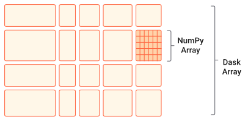

Dask Arrays
------------

.. admonition:: Overview
   :class: Overview

    * **Tutorial:** 20 min

        **Objectives:**
            #. Learn about Dask collections.
            #. Learn about Dask Arrays.

Dask collections are high-level abstractions provided by Dask that mimic the functionality of popular Python libraries while enabling parallel and 
distributed computations. They represent large datasets or computations and operate on them lazily, building a task graph instead of executing 
immediately.

**Dask Array** implements a subset of the NumPy ndarray interface using blocked algorithms, cutting up the large array into many small arrays. 
This lets us compute on arrays larger than memory using all of our cores. We coordinate these blocked algorithms using Dask graphs.

Dask Arrays are a high-level collection in Dask designed for parallel and distributed computation on large, multi-dimensional arrays. 
They provide functionality similar to NumPy arrays but break the data into smaller chunks (sub-arrays), each of which can be processed independently. 
These chunks are distributed across multiple cores or machines, allowing Dask Arrays to handle datasets that are too large to fit into memory.

Relationship to NumPy Arrays 
^^^^^^^^^^^^^^^^^^^^^^^^^^^^^^^^^

Dask Arrays are deeply integrated with NumPy and designed to feel like an extension of it:

1. **API Compatibility**: Dask Arrays use an API that is nearly identical to NumPy's, so operations like slicing, reshaping, arithmetic, and linear 
algebra work similarly. This makes it easy for NumPy users to adopt Dask.
2. **Chunking**: Unlike NumPy, which requires the entire array to fit in memory, Dask Arrays divide data into chunks. Each chunk is a NumPy array, 
allowing computations to proceed in parallel across chunks and enabling out-of-core processing (working on data that doesn't fit in memory).
3. **Lazy Execution:** Dask Arrays build a task graph for computations instead of executing them immediately. For example, when you perform an 
operation like addition, Dask doesn't compute the result right away; it schedules the computation and executes it only when .compute() is called. 
This deferred computation helps optimize resource usage and parallelism.
4. **Integration with NumPy:** Dask Arrays can be created from NumPy arrays or other array-like objects.
5. **Scaling Beyond Memory:** While NumPy is limited by the memory of a single machine, Dask Arrays can scale across multiple cores or 
machines in a cluster, allowing them to handle datasets much larger than what NumPy can process.

When to Use Dask Arrays
^^^^^^^^^^^^^^^^^^^^^^^^^

1. **Large Datasets:** When your arrays are too large to fit into memory.
2. **Parallelism:** When you want to speed up array computations using multiple cores or machines.
3. **Distributed Computing:** When your computations need to be distributed across a cluster

Comparisson between Numpy and Dask Array
^^^^^^^^^^^^^^^^^^^^^^^^^^^^^^^^^^^^^^^^^

..  code-block:: python
    :linenos:

    import numpy as np
    x = np.random.random((10000, 10000))
    y = x + x.T  # In-memory operation

..  code-block:: python
    :linenos:

    import dask.array as da
    x = da.random.random((10000, 10000), chunks=(1000, 1000))
    y = x + x.T  # Builds a task graph, doesn't compute immediately
    result = y.compute()  # Executes and returns the result as a NumPy array

Chunks in Dask Arrays represent how the data is divided into smaller, manageable blocks or sub-arrays. These chunks allow Dask to process portions 
of the array independently and in parallel, enabling efficient computations on arrays that may be too large to fit into memory. Each chunk is stored as 
a separate NumPy array (or another array-like object, such as CuPy for GPU computations). Dask builds a task graph to orchestrate the computation for 
each chunk and combines the results as needed.

By dividing an array into chunks, Dask processes data piece by piece in memory, eliminating the need to load the entire array at once. This approach 
allows Dask to execute operations on chunks in parallel across multiple CPU cores or distributed workers, significantly speeding up computations. 
Additionally, chunks enable Dask to handle datasets larger than the available RAM by efficiently reading and writing intermediate results to disk 
as needed.

Choosing Chunk Sizes
^^^^^^^^^^^^^^^^^^^^^^^^^

Choosing the right chunk size depends on the use case:

1. **Small Enough to Fit in Memory:** Each chunk should be small enough to fit comfortably in memory (e.g., 10–100 MB per chunk is a good starting point).
2. **Large Enough to Minimize Overhead:** Very small chunks increase task graph overhead because managing too many tasks becomes inefficient. Strike a balance to avoid excessive task scheduling.
3. **Workload-Specific:** The chunk shape may vary depending on the operation. 

How does `compute()` work?
^^^^^^^^^^^^^^^^^^^^^^^^^^^

In Dask, the .compute() method triggers the actual execution of a computation. When you perform operations on Dask collections, Dask doesn't compute 
the results immediately. Instead, it builds a task graph that represents the steps required to complete the computation. This lazy evaluation allows 
Dask to optimize the computation and schedule tasks efficiently.

1. **Builds a Task Graph:** Operations on Dask collections create a task graph, which defines the computation workflow in terms of dependencies between tasks.
2. **Schedules the Tasks:** When .compute() is called, Dask uses a scheduler to orchestrate the execution of tasks in the graph. It ensures tasks are executed in the right order while maximizing parallelism.
3. **Executes Tasks:** Each task processes a chunk of data, and intermediate results are combined as needed.
4. **Returns Results:** The final output is collected and returned as a familiar Python object, like a NumPy array, pandas DataFrame, or a regular Python list.

..  code-block:: python
    :linenos:

    import dask.array as da

    # Create a Dask Array with chunks
    x = da.random.random((10000, 10000), chunks=(1000, 1000))

    # Perform some operations (lazy execution)
    y = (x + x.T).sum()

    # Trigger computation and get the result
    result = y.compute()

How does `visualize()` work?
^^^^^^^^^^^^^^^^^^^^^^^^^^^^^

The `.visualize()` method in Dask is used to generate a visual representation of the task graph that Dask constructs during the computation process. 
This graphical representation helps users understand how Dask is planning to execute the computation and visualize the flow of tasks, their 
dependencies, and how they are parallelized. It can be especially useful for debugging or optimizing workflows.

..  code-block:: python
    :linenos:

    import dask.array as da

    # Create a Dask Array with chunks
    x = da.random.random((10000, 10000), chunks=(1000, 1000))

    # Perform some operations (lazy execution)
    y = (x + x.T).sum()

    # Trigger computation and get the result
    y.visualize(filename="task_graph.png")

.. admonition:: Key Points
   :class: hint

    #. Dask Arrays extend the functionality of NumPy arrays to support parallel and distributed computations.
    #. It enables efficient processing of large datasets while maintaining a familiar API for Python developers.