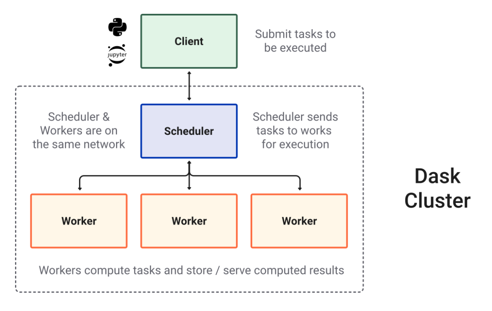

Dask Distributed
---------------

.. admonition:: Overview
   :class: Overview

    * **Tutorial:** 1 Hour

        **Objectives:**
            #. Learn about Dask Distributed.

Dask Distributed is a powerful extension of Dask that enables parallel and distributed computing across multiple machines or a cluster of machines. 
It allows users to scale their Dask computations beyond a single machine by distributing tasks across a cluster, utilizing multiple workers. 
Dask Distributed provides a **distributed scheduler**, which manages the execution of tasks, handles dependencies, and balances workloads efficiently. 
With Dask Distributed, users can easily scale from local machine execution to large-scale, high-performance clusters, making it ideal for large 
datasets, high computational workloads, and complex machine learning or data processing tasks. It integrates seamlessly with other Dask collections 
like `Dask DataFrame`, `Dask Array`, and `Dask Delayed`.

Users interact with the scheduler through a Python session by submitting tasks using `client.submit(function, *args, **kwargs)` for custom 
control or via Dask collections like `dask.array` and `dask.dataframe`. The dynamic asynchronous task scheduler that coordinates multiple worker processes across 
machines and handles requests  from multiple clients. The scheduler tracks tasks as a constantly evolving directed acyclic graph (DAG), where each 
task is a Python function operating on objects,  potentially the results of other tasks. This graph grows with user-submitted computations and 
shrinks as tasks are completed or discarded.

Local cluster
~~~~~~~~~~~~~~~

A local cluster in Dask refers to running Dask's distributed computing framework on your local machine, using multiple processes or threads for 
parallelism without needing a distributed system or cluster of remote machines. It allows you to take advantage of multiple CPU cores on a 
single machine to parallelize tasks and scale computations for large datasets. 

..  code-block:: python
    :linenos:

    from dask.distributed import Client, LocalCluster

    # Set up a local cluster with a specific number of workers
    cluster = LocalCluster(n_workers=4)

    # Connect to the local cluster
    client = Client(cluster)

    # Submit a task to the local cluster
    future = client.submit(lambda x: x + 1, 10)

    # Get the result once the task is complete
    result = future.result()

.. admonition:: Explanation
   :class: attention

        `n_workers` is a parameter of the LocalCluster class that specifies the number of worker processes 
        to create in the local Dask cluster. Each worker process is responsible for executing tasks 
        independently, allowing parallel computation across multiple cores on the same machine.

PBS cluster
~~~~~~~~~~~~~~~

HPC systems typically use a job scheduler like SLURM, PBS, or SGE to manage compute resources. Gadi uses
a modified version of PBS. Each job request specifies the number of nodes, cores, memory, and wall 
time required for a computation. Dask integrates with these schedulers to distribute workloads 
efficiently across the allocated resources.

..  code-block:: python
    :linenos:

    import dask.distributed as dd
    from dask.distributed import Client, LocalCluster, progress
    from dask_jobqueue import PBSCluster
    from dask.distributed import get_worker
    import os

    os.environ['DASK_PYTHON'] = '/scratch/vp91/Training-Venv/parallel_python/bin/python3'

.. admonition:: Explanation
   :class: attention

   It is very important to make sure all element of Dask use the same Python version.

..  code-block:: python
    :linenos:

    setup_commands = ["module load python3/3.11.0", "module load cmake/3.16.2", "source /scratch/abc/Training-Venv/parallel_python/bin/activate"]

.. admonition:: Explanation
   :class: attention

   The first two commands load the required modules while last cpmmand activates the Python environment.
   This ensures that all the **node** in the cluster used the same module and also the same Python
   environment.

..  code-block:: python
    :linenos:

    extra = ['-q normal',
         '-P vp91', 
         '-l ncpus=48', 
         '-l mem=192GB']

.. admonition:: Explanation
   :class: attention

   Gadi uses a seperate falgs than an out-of-the-box PBS scheduler. So these different flags and 
   their corresponding values are given as **extra** instructions.

..  code-block:: python
    :linenos:

    cluster = PBSCluster(walltime="00:20:00", 
                     cores=48, 
                     memory="192GB",
                     shebang='#!/usr/bin/env bash',
                     job_extra_directives=extra, 
                     local_directory='$TMPDIR', 
                     job_directives_skip=["select"], 
                     interface="ib0",
                     job_script_prologue=setup_commands,
                     python=os.environ["DASK_PYTHON"])

The code sets up a Dask cluster on an HPC system using PBS as the job scheduler. It configures each 
job to use 48 CPU cores, 192GB of memory, and a 20-minute runtime, with additional customizations 
like temporary storage (`$TMPDIR`) and high-speed network communication (`ib0`). The cluster launches
Dask workers via PBS jobs, enabling distributed and parallel computations, and connects to the 
workers using a Python client.

.. admonition:: Explanation
   :class: attention

   1. `walltime`: Specifies the maximum duration for each job submitted to the PBS scheduler. In 
   this case, each job will run for 20 minutes. Format: HH:MM:SS.

   2. `cores`: Specifies the number of CPU cores allocated per job. Each Dask worker will 
   utilize 48 cores for parallel processing.

   3. `memory`: Specifies the total memory available for each job. Each worker will use up to 
   192 GB of RAM.

   4. `shebang`: Defines the shebang line at the top of the job script, indicating that the script should be executed using bash.
   This is important for environments where custom shells or paths are used.

   5. `job_extra_directives`: Passes additional PBS directives (specified in the extra variable) to customize the job script further.

   6. `local_directory`: Specifies a local directory on the compute node to store temporary files for Dask workers.

   7. `job_directives_skip`: Skips generating certain PBS directives automatically. Here, the select directive is 
   omitted because it might conflict with how resources are allocated in the cluster. Useful for more fine-grained control over the job script.

   8. `interface`: Specifies the network interface for inter-worker communication. `ib0` typically refers to an 
   InfiniBand interface, used for high-speed, low-latency networking in HPC systems.

   9. `job_script_prologue`: Defines a list of shell commands (stored in setup_commands) to be executed before 
   starting the Dask worker processes.

   10. `python=os.environ["DASK_PYTHON"]` : Specifies the Python executable to be used for running Dask worker processes.

..  code-block:: python
    :linenos:

    cluster.scale(jobs=2)

The code `cluster.scale(jobs=2)` dynamically scales the Dask cluster to have 2 active jobs running 
on the HPC system.

.. admonition:: Explanation
   :class: attention

   The above code dynamically adjust the computational resources based on workload requirements.
   Each "job" corresponds to a PBS job (or worker group) submitted to the scheduler. 
   The number of workers (and resources like cores and memory) within each job is determined by the 
   configuration provided when the cluster was created (e.g., `cores=48`, `memory="192GB"` in 
   PBSCluster).

..  code-block:: python
    :linenos:

    client = Client(cluster)

.. admonition:: Explanation
   :class: attention

   The code `client = Client(cluster)` connects a Dask client to the specified cluster, enabling 
   interaction with the Dask scheduler and workers. Once connected, the `client` acts as a central 
   interface to interact with the cluster.

..  code-block:: python
    :linenos:

    def slow_increment(x):
    return x+1

    futures = client.submit(slow_increment, 5000)

.. admonition:: Explanation
   :class: attention

    `client.submit()` sends the `slow_increment` function and its argument (5000) to the Dask cluster for computation.
    `client.submit()` is non-blocking, meaning it immediately returns a future object without waiting for the computation to finish.
    The task is assigned to the first available worker that is idle or has the resources to execute it.

.. admonition:: Key Points
   :class: hint

    #. Dask distributed uses an event-driven scheduler to manage task execution across multiple workers while respecting task dependencies.
    #. Dask scales from a single machine to a distributed cluster, adapting to changing workloads.
    #. Tasks and workers communicate asynchronously for efficient execution and data transfer.
    