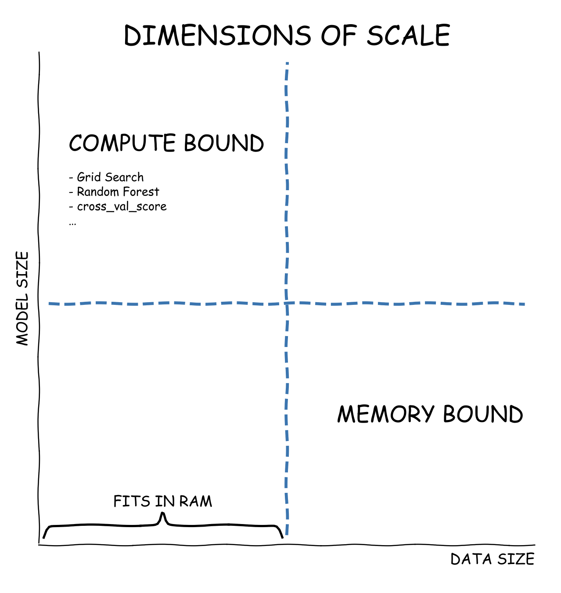

Dask ML
-------

.. admonition:: Overview
   :class: Overview

    * **Tutorial:** 10 Minutes

        **Objectives:**
            - Learn how to scale Machine learning codes using dask.

Dask-ML provides scalable machine learning in Python using Dask alongside popular machine learning 
libraries like Scikit-Learn, XGBoost, and others.  

Dimensions of Scale
~~~~~~~~~~~~~~~~~~~~

Challenge 1: Scaling Model Size
^^^^^^^^^^^^^^^^^^^^^^^^^^^^^^^^^

One type of scaling challenge arises when models become so large or complex that they significantly impact workflow efficiency. In this scenario, 
tasks such as model training, prediction, or evaluation may eventually complete but take an impractically long time. This situation indicates being 
compute-bound.  To address this, you can optimize your workflow by leveraging parallel processing techniques, enabling computations to be distributed 
across multiple cores or machines. 

Challenge 2: Scaling Data Size
^^^^^^^^^^^^^^^^^^^^^^^^^^^^^^^^

Another common scaling challenge occurs when datasets grow too large to fit into memory. In such cases, even loading the data into standard in-memory 
structures like arrays or dataframes becomes unfeasible. One way way to address this challenge is by breaking them into manageable chunks, 
allowing preprocessing, training, and other operations to be performed efficiently. 

Dask-ML can effectively address both challenges. To tackle the first challenge, a Dask cluster can be used to parallelize existing machine learning 
algorithms across multiple machines, significantly speeding up computation. For the second challenge, Dask leverages its high-level collections, 
such as Dask Arrays and Dask DataFrames, which are designed to span an entire cluster, enabling efficient processing of datasets that exceed memory 
limitations.

Dask and Scikit-Learn
~~~~~~~~~~~~~~~~~~~~~~~

Dask-ML and scikit-learn are closely related, as Dask-ML extends the functionality of scikit-learn to handle large datasets and distributed computing. 
While scikit-learn is a widely used library for machine learning with a focus on single-machine performance and ease of use, it can struggle with 
scaling to datasets that exceed memory limits. Dask-ML addresses this limitation by integrating with Dask, to enable 
distributed and scalable machine learning workflows. 

Dask-MLprovides drop-in replacements for many scikit-learn estimators, such as linear regression and 
clustering, while maintaining scikit-learn's familiar API. This allows users to leverage scikit-learn's simplicity and versatility while scaling their 
computations across multiple cores or even a distributed cluster, making Dask-ML ideal for handling big data challenges in machine learning.

For instance, the codes snippets given below shows how a dummy data set generation will look line in Scikit-Learn and Dask-ML

..  code-block:: python
    :linenos:

    import numpy as np
    from sklearn.datasets import make_regression
    from sklearn.model_selection import train_test_split

    # Generate a regression dataset with NumPy
    X, y = make_regression(n_samples=125, n_features=4, random_state=0)

    # Split the dataset into training and testing sets
    X_train, X_test, y_train, y_test = train_test_split(X, y, test_size=0.25, random_state=42)

..  code-block:: python
    :linenos:

    import dask.array as da
    from dask_ml.datasets import make_regression
    from dask_ml.model_selection import train_test_split

    # Generate a regression dataset with Dask array
    X, y = make_regression(n_samples=125, n_features=4, random_state=0, chunks=50)

    # Split the dataset into training and testing sets
    X_train, X_test, y_train, y_test = train_test_split(X, y)

Some of the main use cases of using Dask-ML is discussed below.

.. admonition:: Key Points
   :class: hint

        - Dask-ML can be used to scale compute intensive ML jobs.
        - Dask-ML can be used to scale memory intensive ML jobs.
        - Dask-ML works with most Scikit-Learn APIs. 